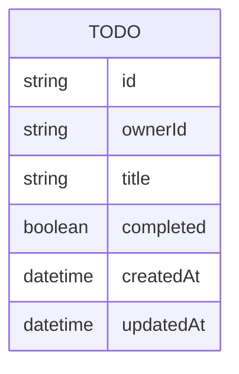

# Domain model

The domain is a single entity: a todo item owned by exactly one signed-in
user, identified by their Thunder subject id.

`ownerId` is the caller's Thunder subject (`sub`) claim, never a client-supplied
value — it is how each user's list stays private to them.